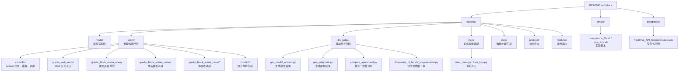
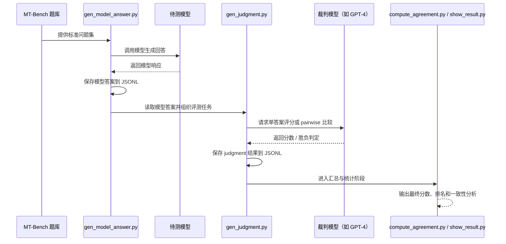
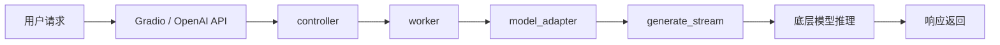
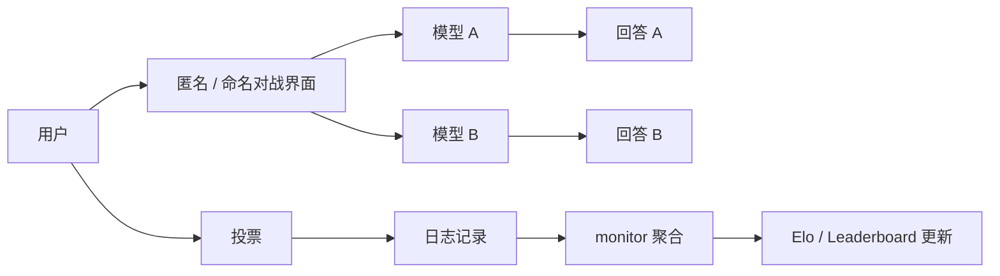
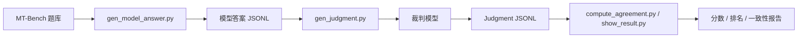

# FastChat 架构与自动化评测技术报告

## 摘要

FastChat（lm-sys/FastChat）是一个面向大语言模型聊天系统的开放平台，覆盖模型训练、分布式推理服务、匿名对战式交互、自动化评测与排行榜统计等完整链路。该工程不仅是一个聊天服务框架，更是一个将“模型接入—在线服务—用户反馈—自动评测—榜单更新”串联起来的实验与运营平台。本文从目录结构、核心模块、数据流与评测机制四个维度，对 FastChat 的工程设计进行技术化梳理。

## 1. 工程定位与核心能力

FastChat 的能力边界可以概括为四个层次：

1. **训练与微调层**
   - 提供对话数据训练、LoRA / QLoRA、FSDP、DeepSpeed 等训练支持。
   - 主要入口集中在 `fastchat/train/` 与 `scripts/`。

2. **模型适配与推理层**
   - 通过统一的 model adapter 机制屏蔽不同模型架构、tokenizer 与对话模板差异。
   - 向上提供 OpenAI-compatible REST API、Gradio UI 与批量/流式生成能力。

3. **交互与采集层**
   - 支持 Chatbot Arena 式匿名双盲对战，也支持命名模型对比与多模态交互。
   - 该层同时负责记录用户行为、投票、日志与统计数据。

4. **评测与治理层**
   - 以 MT-Bench 和 LLM-as-a-judge 为核心，自动生成模型答案、裁判判断与结果汇总。
   - 与监控模块结合后，可形成面向真实用户反馈的持续排名体系。

## 2. 目录级架构视图

### 2.1 模块职责说明

| 目录 | 主要职责 | 代表文件 |
|---|---|---|
| `fastchat/model/` | 统一模型接入、对话模板与生成函数选择 | `model_adapter.py` |
| `fastchat/serve/` | 模型服务、Web UI、Arena 交互与监控 | `controller.py`、`gradio_web_server.py`、`monitor.py` |
| `fastchat/llm_judge/` | 自动化评测、答案生成、裁判打分、结果汇总 | `gen_model_answer.py`、`gen_judgment.py` |
| `fastchat/train/` | 模型训练与微调 | `train_mem.py`、`train_lora.py` |
| `fastchat/data/` | 数据统计、检查与预处理 | `get_stats.py`、`inspect_data.py` |
| `scripts/` | 便于复现的命令脚本 | `train_vicuna_7b.sh`、`train_lora.sh` |
| `docs/` | 使用说明与系统设计文档 | `arena.md`、`training.md`、`model_support.md` |
| `playground/` | Notebook、示例与实验代码 | `FastChat_API_GoogleColab.ipynb` |

## 3. 关键架构设计

### 3.1 模型适配层：屏蔽异构模型差异

FastChat 的一个关键设计是 `fastchat/model/model_adapter.py`。它通过 adapter 抽象把不同模型统一到同一套调用模型：

- 统一 conversation template（对话模板）
- 统一 generation stream 接口
- 针对不同模型族提供专门 adapter
- 支持 PEFT/LoRA、Vicuna、LongChat、T5、ChatGLM 等差异化实现

该设计的价值在于：**上层服务无需关心模型底层实现细节，只需通过统一接口完成接入和推理。**

### 3.2 服务层：controller-worker 架构

FastChat 采用 controller-worker 分层：

- **controller**：负责 worker 注册、模型可见性管理与请求调度。
- **worker**：负责加载模型、执行推理、返回流式响应。
- **web server**：负责与用户交互，并将请求路由到对应 worker。

这种设计的核心收益是：

1. 支持多模型同时在线。
2. 支持水平扩展与分布式部署。
3. 便于将推理后端替换为不同引擎或量化方案。

### 3.3 Arena 层：匿名对战与真实反馈采集

Chatbot Arena 是 FastChat 中最具代表性的在线系统。其设计特点包括：

- 匿名双盲：用户不知道具体模型身份，减少先验偏好。
- 双模型对比：用户同时查看两个模型的回答并投票。
- 日志闭环：聊天记录、投票结果、模型调用统计都会沉淀到监控层。

该机制的本质是把“用户体验”转化为可统计、可比较、可持续更新的数据资产。

### 3.4 评测层：LLM-as-a-judge

FastChat 的自动化评测并非传统的词面匹配，而是通过强模型作为裁判，判断回答质量。这种设计适合开放式对话任务，因为此类任务：

- 没有唯一标准答案
- 需要考虑多维质量指标
- 需要处理多轮上下文与用户意图

因此，FastChat 采用更接近真实使用场景的“裁判式评测”范式。

## 4. 自动化评测流程

### 4.1 总体时序图

### 4.2 阶段拆解

#### 阶段一：生成模型答案
对应脚本：`fastchat/llm_judge/gen_model_answer.py`

该阶段的职责是：
- 读取 `data/mt_bench/question.jsonl`
- 按模型配置生成回答
- 输出到 `data/mt_bench/model_answer/[MODEL-ID].jsonl`

本阶段的关键问题是“保证被测模型在同一题目集上输出可复现、结构化的答案”。

#### 阶段二：生成裁判判断
对应脚本：`fastchat/llm_judge/gen_judgment.py`

该阶段将模型答案提交给裁判模型，形成自动判分任务。FastChat 支持三种典型模式：

- `single`：对单个回答直接评分；
- `pairwise-baseline`：与固定基线模型比较；
- `pairwise-all`：对所有模型组合进行两两比较。

其中，pairwise 模式在开放式生成任务中通常更稳健，因为它降低了绝对分数标定误差。

#### 阶段三：一致性与结果分析
对应脚本：`fastchat/llm_judge/compute_agreement.py`、`show_result.py`

该阶段关注两个问题：

1. 裁判结果是否稳定？
2. 输出的分数是否能支持模型排名与横向比较？

因此，该阶段不仅给出最终分数，还用于验证 judge 机制本身的可信度。

## 5. 数据流与调用链

### 5.1 在线推理数据流

### 5.2 Arena 投票与监控数据流

### 5.3 自动化评测数据流

## 6. 关键文件阅读顺序

建议按以下顺序阅读源码：

1. `README.md`
   - 项目总览与使用入口。
2. `docs/arena.md`
   - Chatbot Arena 的系统说明。
3. `fastchat/model/model_adapter.py`
   - 模型适配与生成函数选择。
4. `fastchat/serve/controller.py`
   - 服务调度与 worker 管理。
5. `fastchat/serve/gradio_web_server.py`
   - 用户请求入口。
6. `fastchat/serve/gradio_block_arena_anony.py`
   - 匿名对战交互逻辑。
7. `fastchat/serve/monitor/monitor.py`
   - 排行榜与监控数据聚合。
8. `fastchat/llm_judge/README.md`
   - MT-Bench 评测总体流程。
9. `fastchat/llm_judge/gen_model_answer.py`
   - 生成模型答案。
10. `fastchat/llm_judge/gen_judgment.py`
    - 生成裁判结果。
11. `fastchat/llm_judge/compute_agreement.py`
    - 裁判一致性分析。
12. `scripts/train_vicuna_7b.sh`、`scripts/train_lora.sh`
    - 训练/微调入口的参数组织方式。

## 7. 结论

从系统设计视角看，FastChat 的价值不在于单一聊天能力，而在于其完成了一个完整闭环：

- 模型接入与统一适配
- 多模型推理与在线服务
- 匿名对战与真实用户反馈采集
- 基于 LLM-as-a-judge 的自动化评测
- 结果聚合、排行榜更新与持续演化

因此，FastChat 可以被视为一个面向大模型研究与产品化落地的**一体化实验平台**，同时兼顾了工程可扩展性、评测可复现性与线上运营能力。