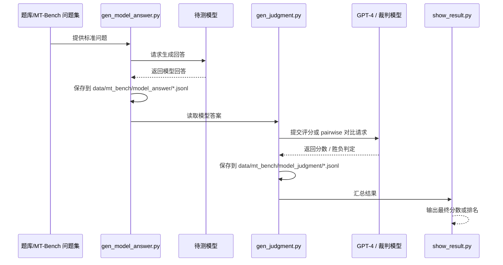
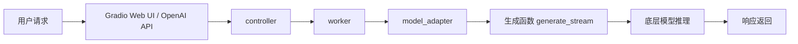
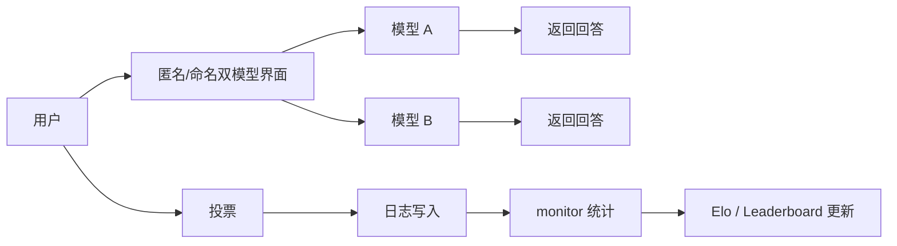
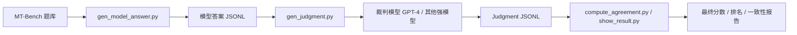

# FastChat 架构图与自动化评测流程

本文基于 FastChat 仓库（lm-sys/FastChat）整理，目标是从目录结构、核心模块、调用链和评测流程四个角度理解这个工程。

## 1. 工程核心能力

FastChat 是一个面向大语言模型聊天系统的开放平台，核心能力可以概括为四类：

1. **训练与微调**
   - 支持对话数据训练、LoRA / QLoRA、FSDP / DeepSpeed 等训练方式。
   - 典型入口位于 `fastchat/train/` 和 `scripts/`。

2. **模型推理与服务**
   - 提供 OpenAI-compatible REST API。
   - 支持多模型、分布式 worker/controller 架构、Gradio Web UI。

3. **匿名对战与排行榜**
   - Chatbot Arena 支持匿名双盲对话、用户投票、模型对比与 Elo 排行。
   - 相关逻辑主要位于 `fastchat/serve/monitor/` 和 `fastchat/serve/gradio_block_arena_*.py`。

4. **自动化评测**
   - 以 MT-Bench 为核心，通过 LLM-as-a-judge 机制进行自动化评分或 pairwise 比较。
   - 相关逻辑主要位于 `fastchat/llm_judge/`。

---

## 2. 按目录划分的架构图

```mermaid
graph TD
    A[README.md / docs] --> B[fastchat 核心包]
    A --> C[scripts]
    A --> D[playground]

    B --> B1[fastchat/model<br/>模型适配层]
    B --> B2[fastchat/serve<br/>推理与服务层]
    B --> B3[fastchat/llm_judge<br/>自动化评测层]
    B --> B4[fastchat/train<br/>训练与微调]
    B --> B5[fastchat/data<br/>数据处理工具]
    B --> B6[fastchat/protocol<br/>请求/响应协议]
    B --> B7[fastchat/modules<br/>通用模块]

    B2 --> B21[controller<br/>worker 注册与调度]
    B2 --> B22[gradio_web_server<br/>Web UI]
    B2 --> B23[gradio_block_arena_anony<br/>匿名双盲 Arena]
    B2 --> B24[gradio_block_arena_named<br/>可见模型名对战]
    B2 --> B25[gradio_block_arena_vision*<br/>视觉/多模态 Arena]
    B2 --> B26[monitor<br/>统计与排行榜]

    B3 --> B31[gen_model_answer.py<br/>生成模型答案]
    B3 --> B32[gen_judgment.py<br/>生成裁判结果]
    B3 --> B33[compute_agreement.py<br/>一致性分析]
    B3 --> B34[download_mt_bench_pregenerated.py<br/>预生成数据下载]

    B4 --> B41[train_mem.py / train_lora.py<br/>训练入口]
    C --> C1[train_vicuna_7b.sh]
    C --> C2[train_lora.sh]
    C --> C3[build-api.sh]

    D --> D1[FastChat_API_GoogleColab.ipynb]
    D --> D2[test_embedding/]
```

### 架构解读

- `fastchat/model` 负责把不同模型统一到同一套对话模板与生成接口。
- `fastchat/serve` 负责把模型真正跑起来，并对外提供 API / UI / Arena。
- `fastchat/llm_judge` 负责自动化评测，形成“题目 -> 答案 -> 裁判 -> 分数”的闭环。
- `fastchat/serve/monitor` 负责把真实用户投票与日志聚合成排行榜与统计面板。
- `fastchat/train` 与 `scripts/` 负责训练、微调和实验复现。

---

## 3. 自动化评测机制原理

FastChat 的自动化评测核心思想是：**让更强的模型充当裁判，对待测模型的回答进行评分或比较。**

### 3.1 MT-Bench 评测流程

MT-Bench 是 FastChat 中最典型的自动化评测体系。

### 3.2 关键步骤

#### Step 1：生成模型答案
对应脚本：`fastchat/llm_judge/gen_model_answer.py`

作用：
- 读取 `data/mt_bench/question.jsonl`
- 调用被测模型生成回答
- 将答案写入 `data/mt_bench/model_answer/[MODEL-ID].jsonl`

#### Step 2：生成裁判判断
对应脚本：`fastchat/llm_judge/gen_judgment.py`

作用：
- 将模型答案送入裁判模型（常见是 GPT-4）
- 支持三种模式：
  - `single`：单答案评分
  - `pairwise-baseline`：与基线模型对比
  - `pairwise-all`：全量两两对比
- 生成 judgment 文件，便于后续统计

#### Step 3：统计一致性与结果
对应脚本：`fastchat/llm_judge/compute_agreement.py`、`show_result.py`

作用：
- 统计裁判之间一致性
- 验证自动化评测是否稳定可靠
- 输出模型在 MT-Bench 上的综合表现

---

## 4. 调用链 / 数据流

### 4.1 在线推理链路

### 4.2 Arena 投票链路

### 4.3 自动化评测链路

---

## 5. 入门阅读建议

建议按下面顺序读代码：

1. `README.md`
   - 看项目目标、安装方式、主功能说明。

2. `docs/arena.md`
   - 看 Chatbot Arena 的整体工作方式。

3. `fastchat/model/model_adapter.py`
   - 看模型如何统一适配。

4. `fastchat/serve/controller.py`
   - 看服务调度与 worker 注册机制。

5. `fastchat/serve/gradio_web_server.py`
   - 看 Web 服务入口。

6. `fastchat/serve/gradio_block_arena_anony.py`
   - 看匿名双盲 Arena 的交互逻辑。

7. `fastchat/serve/monitor/monitor.py`
   - 看榜单、统计、监控如何形成闭环。

8. `fastchat/llm_judge/README.md`
   - 看 MT-Bench 自动化评测流程。

9. `fastchat/llm_judge/gen_model_answer.py`
   - 看模型答案如何生成。

10. `fastchat/llm_judge/gen_judgment.py`
    - 看裁判评测如何生成。

11. `fastchat/llm_judge/compute_agreement.py`
    - 看 judge 一致性如何计算。

12. `scripts/train_vicuna_7b.sh` / `scripts/train_lora.sh`
    - 看训练入口与参数组织方式。

---

## 6. 小结

FastChat 的关键价值不只是“能聊天”，而是它把以下能力串成了一个完整体系：

- 模型训练与微调
- 多模型推理与服务
- 匿名对战与真实用户投票
- 自动化评测与 judge 体系
- 榜单统计与持续更新

因此，它更像一个**大模型实验、部署、评测、运营的一体化平台**，而不只是一个聊天框架。