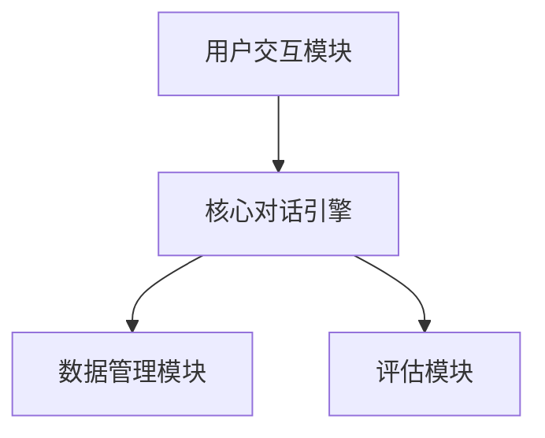
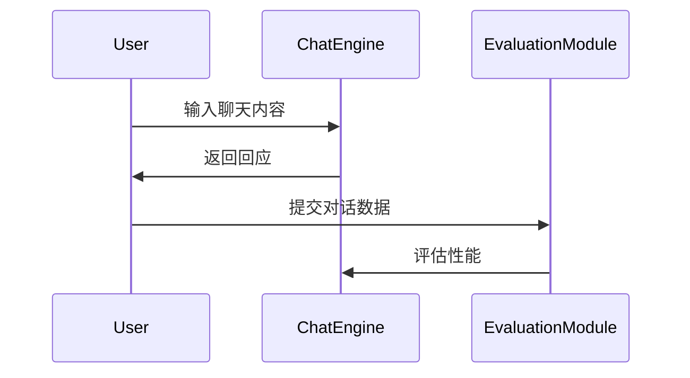

# FastChat Architecture and Automated Evaluation

## Architecture Overview
FastChat是一个高效的对话系统，旨在提供快速且可靠的聊天体验。它主要由以下模块构成：

- **用户交互模块**：负责接收用户输入和提供响应。
- **核心对话引擎**：处理所有对话逻辑，包括状态管理和上下文追踪。
- **数据管理模块**：负责存储用户数据和对话历史。
- **评估模块**：用于自动化对话系统性能的评估。

## 目录级架构图

## 自动化评估流序列图

## 推荐阅读列表
- [FastChat 官方文档](https://github.com/lm-sys/FastChat)
- [对话系统研究论文](https://arxiv.org/list/cs.CL/recent)

该文档提供了FastChat的核心能力、模块边界、数据流和评估管道的详细信息。